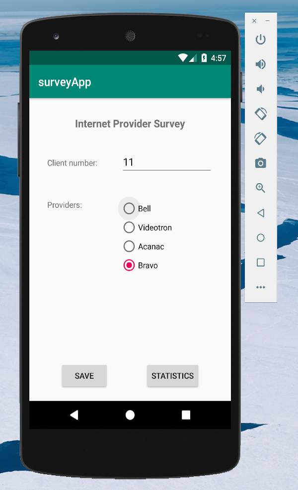
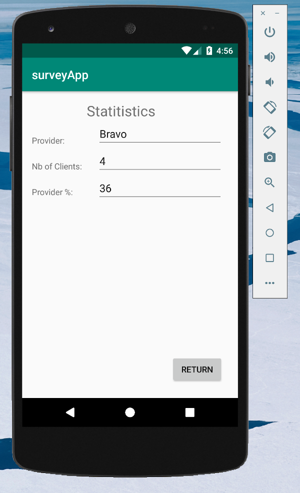

# survey-app

Simple Android app written in java that gather survey data about internet providers and show related statistics. It make use of serialize to pass data as objects between activities

Features:

- Static client id that auto increment
- Collect data through the UI
- Display statistics about percentage of customers using internt providers

